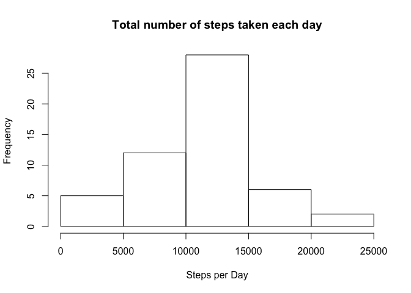
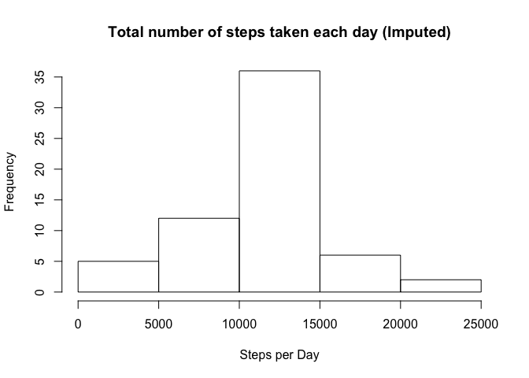

# Reproducible Research: Peer Assessment 1


## Loading and preprocessing the data

```r
# source
sourceURL<-"https://d396qusza40orc.cloudfront.net/repdata%2Fdata%2Factivity.zip"
sourceFileCompressed<-"activity.zip"
sourceFile<-"activity.csv"

# downlod the compressed file if it doesn't exist in the current directory
if (!file.exists(sourceFileCompressed)) {
  download.file(sourceURL, destfile = sourceFileCompressed, mode = "wb")
}

# unzip if it's not already
if (!file.exists(sourceFile)) {
  unzip(sourceFileCompressed, overwrite = T)
}

# read the file into a data frame
activity <- read.csv(sourceFile, sep = ",", heade = TRUE)
summary(activity)
```

```
##      steps                date          interval     
##  Min.   :  0.00   2012-10-01:  288   Min.   :   0.0  
##  1st Qu.:  0.00   2012-10-02:  288   1st Qu.: 588.8  
##  Median :  0.00   2012-10-03:  288   Median :1177.5  
##  Mean   : 37.38   2012-10-04:  288   Mean   :1177.5  
##  3rd Qu.: 12.00   2012-10-05:  288   3rd Qu.:1766.2  
##  Max.   :806.00   2012-10-06:  288   Max.   :2355.0  
##  NA's   :2304     (Other)   :15840
```


## What is mean total number of steps taken per day?

```r
# 1. Calculate the total number of steps taken per day
totalStepsPerDay <- aggregate(steps ~ date, data = activity, FUN = "sum")
# totalStepsPerDay
summary(totalStepsPerDay)
```

```
##          date        steps      
##  2012-10-02: 1   Min.   :   41  
##  2012-10-03: 1   1st Qu.: 8841  
##  2012-10-04: 1   Median :10765  
##  2012-10-05: 1   Mean   :10766  
##  2012-10-06: 1   3rd Qu.:13294  
##  2012-10-07: 1   Max.   :21194  
##  (Other)   :47
```

```r
# 2. If you do not understand the difference between a histogram and a barplot, research the difference between them. Make a histogram of the total number of steps taken each day
hist(totalStepsPerDay$steps, xlab = "Steps per Day", ylab = "Frequency", main = "Total number of steps taken each day")
```

<!-- -->

```r
# 3. Calculate and report the mean and median of the total number of steps taken per day
print(paste0("Mean of the total number of steps taken per day: ", round(mean(totalStepsPerDay$steps))), quote = FALSE)
```

```
## [1] Mean of the total number of steps taken per day: 10766
```

```r
print(paste0("Median of the total number of steps taken per day: ", median(totalStepsPerDay$steps)), quote = FALSE)
```

```
## [1] Median of the total number of steps taken per day: 10765
```


## What is the average daily activity pattern?

```r
meanStepsPerInterval <- aggregate(steps ~ interval, data = activity, FUN = "mean")

# 1. Make a time series plot (i.e. 𝚝𝚢𝚙𝚎 = "𝚕") of the 5-minute interval (x-axis) and the average number of steps taken, averaged across all days (y-axis)
plot(x=meanStepsPerInterval$interval, y=meanStepsPerInterval$steps, type='l', main = "Average Daily Activity Pattern", xlab = "Interval", ylab = "Average number of steps")

# 2. Which 5-minute interval, on average across all the days in the dataset, contains the maximum number of steps?
maxSteps <- as.integer(subset(meanStepsPerInterval, steps==max(steps))["interval"])
print(paste0("The 5-min interval with maximum number of steps is: ", maxSteps), quote = FALSE)
```

```
## [1] The 5-min interval with maximum number of steps is: 835
```

```r
abline(v=maxSteps, col = 10)
```

<!-- -->


## Imputing missing values

```r
library(plyr)
library(Hmisc)
```

```
## Loading required package: lattice
```

```
## Loading required package: survival
```

```
## Loading required package: Formula
```

```
## Loading required package: ggplot2
```

```
## 
## Attaching package: 'Hmisc'
```

```
## The following objects are masked from 'package:plyr':
## 
##     is.discrete, summarize
```

```
## The following objects are masked from 'package:base':
## 
##     format.pval, round.POSIXt, trunc.POSIXt, units
```

```r
# 1. Calculate and report the total number of missing values in the dataset (i.e. the total number of rows with 𝙽𝙰s)
print(paste0("Total number of missing values in the dataset: ", nrow(subset(activity, is.na(steps)==T)["steps"])), quote = FALSE)
```

```
## [1] Total number of missing values in the dataset: 2304
```

```r
# 2. Devise a strategy for filling in all of the missing values in the dataset. The strategy does not need to be sophisticated. For example, you could use the mean/median for that day, or the mean for that 5-minute interval, etc.
# using ddply and impute function to replace NAs with mean values. 
activity2 <- ddply(activity, "interval", mutate, imputed.steps = round(impute(steps, mean)))

# 3. Create a new dataset that is equal to the original dataset but with the missing data filled in.
activity2 <- activity2[with(activity2, order(date, interval)),]   # sort/order the dataframe by date and interval
activity2 <- subset(activity2, select = -c(steps))                # remove column (steps) with NAs
colnames(activity2)[3] <- "steps"                                 # rename column imputed.steps to steps
rownames(activity2) <- seq(length=nrow(activity2))                # re-sequence the row names - not important
# activity2 is the new dataset with imputed values


# 4. Make a histogram of the total number of steps taken each day and Calculate and report the mean and median total number of steps taken per day. Do these values differ from the estimates from the first part of the assignment? What is the impact of imputing missing data on the estimates of the total daily number of steps?
totalStepsPerDay2 <- aggregate(steps ~ date, data = activity2, FUN = "sum")
hist(totalStepsPerDay2$steps, xlab = "Steps per Day", ylab = "Frequency", main = "Total number of steps taken each day (Imputed)")
```

<!-- -->

```r
print(paste0("Mean of the total number of steps taken per day (with imputed): ", round(mean(totalStepsPerDay2$steps))), quote = FALSE)
```

```
## [1] Mean of the total number of steps taken per day (with imputed): 10766
```

```r
print(paste0("Median of the total number of steps taken per day (with imputed): ", median(totalStepsPerDay2$steps)), quote = FALSE)
```

```
## [1] Median of the total number of steps taken per day (with imputed): 10762
```

#### Impact of imputing missing data on the estimates of total daily number of steps:
* The mean with imputed values stayed at the same level after rounding (10766) 
* The median with imputed values went down by 3 steps (from 10765 to 10762). 


## Are there differences in activity patterns between weekdays and weekends?


```r
library(chron)      # to use is.weekend

# For this part the 𝚠𝚎𝚎𝚔𝚍𝚊𝚢𝚜() function may be of some help here. Use the dataset with the filled-in missing values for this part.

# 1. Create a new factor variable in the dataset with two levels – “weekday” and “weekend” indicating whether a given date is a weekday or weekend day.
isweekend <- function(date) { ifelse(is.weekend(date), "weekend", "weekday") }
activity2 <- ddply(activity2, "date", mutate, weekdays = isweekend(date))

# 2. Make a panel plot containing a time series plot (i.e. 𝚝𝚢𝚙𝚎 = "𝚕") of the 5-minute interval (x-axis) and the average number of steps taken, averaged across all weekday days or weekend days (y-axis). See the README file in the GitHub repository to see an example of what this plot should look like using simulated data.
meanStepsPerInterval2 <- aggregate(steps ~ interval + weekdays, data = activity2, FUN = "mean")
library(ggplot2)
ggplot(meanStepsPerInterval2, aes(x=interval, y=steps)) + geom_line() + facet_wrap(~weekdays, nrow=2)
```

<!-- -->

